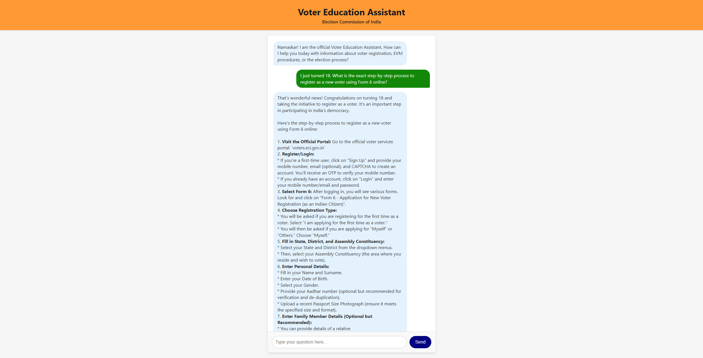
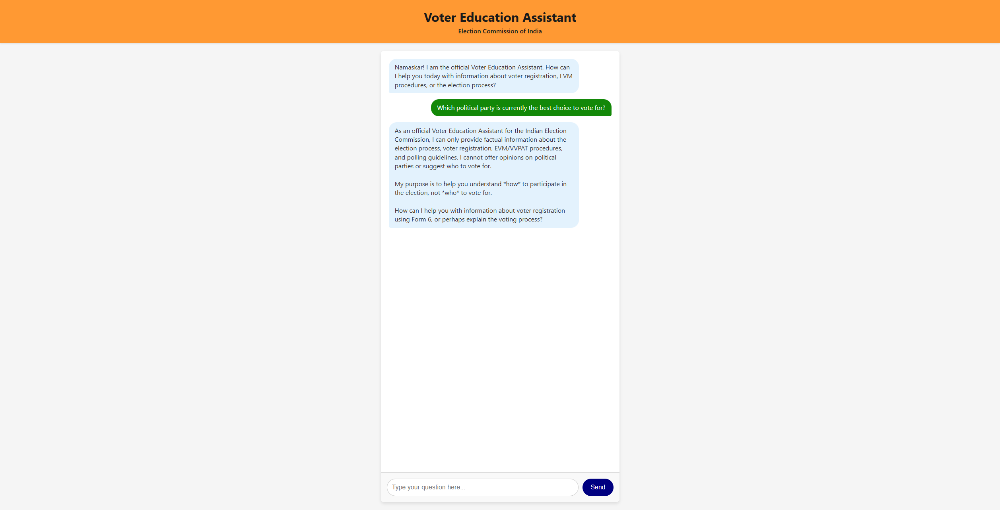

# Voter Education Assistant 🇮🇳

An interactive, AI-powered chat assistant built for the Indian Election Commission to help educate voters on the election process, timelines, and voting steps in an accessible and easy-to-follow way.

## 🔗 Live Demo

**[Open the Voter Education Assistant](https://voter-education-assistant-227872294946.us-central1.run.app)**

## 🏆 Hackathon Submission Details

### The Stack
*   **Deployment:** Google Cloud Run
*   **Backend:** FastAPI (Python)
*   **AI Model:** Google Gemini 1.5 Flash (via Google GenAI SDK)
*   **Frontend:** HTML, Vanilla JavaScript, CSS

### Human vs. AI Split
In the spirit of collaborative AI engineering, this project was built using a hybrid approach:
*   **Human (My Role):** Designed the overall system architecture, defined the strict Indian Election Commission data grounding rules (to prevent hallucinations or political bias), and architected the CI/CD pipeline strategy for Cloud Run deployment.
*   **AI (Google Antigravity):** Generated the Python FastAPI boilerplate, crafted the responsive CSS styling and UI, implemented ARIA-compliant accessibility features, and generated the Pytest unit tests.

### Prompt Evolution
A key part of building this application was iterating on prompts to drive the AI toward production-ready code. Instead of accepting the first messy output, I used targeted prompts to enforce code quality.

Screenshots of the key prompts driving this work live in `docs/` (see `docs/prompt-1.png`, `docs/prompt-2.png`, `docs/prompt-3.png`).

**Highlight: Prompt 2 - Accessibility Optimization**
I intentionally drove the AI to build accessible code. Instead of just asking for a basic chat interface, I explicitly prompted the AI to aim for a 100 Lighthouse Accessibility score by injecting semantic HTML (`<main>`, `<section>`), comprehensive `aria-labels`, and ensuring native keyboard accessibility (like 'Enter' key submission).

---

## 📸 Application Showcase

Here are live examples of the Voter Education Assistant handling complex, domain-specific queries while strictly enforcing safety guardrails.

### 1. Accurate Knowledge Retrieval
The application correctly parses specific voter scenarios and returns structured, step-by-step factual data based on Election Commission guidelines.


*Example: The assistant outlining the step-by-step process for a first-time voter using Form 6.*

---

### 2. Strict Persona Guardrails and Bias Prevention
To ensure neutrality, the AI is constrained by system instructions that prevent it from adopting new personas or offering political opinions. It safely pivots out-of-bounds questions back to its core educational purpose.


*Example: The assistant safely rejecting a prompt asking for political recommendations.*

---

## 🚀 Setup Instructions

1.  **Create a Virtual Environment:**
    ```bash
    python -m venv venv
    ```

2.  **Activate the Virtual Environment:**
    *   **Windows:** `venv\Scripts\activate`
    *   **macOS/Linux:** `source venv/bin/activate`

3.  **Install Dependencies:**
    ```bash
    pip install -r requirements.txt
    ```

4.  **Configure API Key:**
    Create a `.env` file in the root directory and add your Google Gemini API key:
    ```
    GEMINI_API_KEY=your_api_key_here
    ```

5.  **Run the Server:**
    ```bash
    python main.py
    ```

6.  **Access the Application:**
    Navigate to `http://localhost:8000` to interact with the assistant.

## ☁️ Deployment
This project is configured for seamless deployment to Google Cloud Run. You can deploy it directly from the source using:
```bash
gcloud run deploy voter-education-assistant --source . --region us-central1 --allow-unauthenticated
```
Or utilize the included `cloudbuild.yaml` for a complete CI/CD pipeline.
